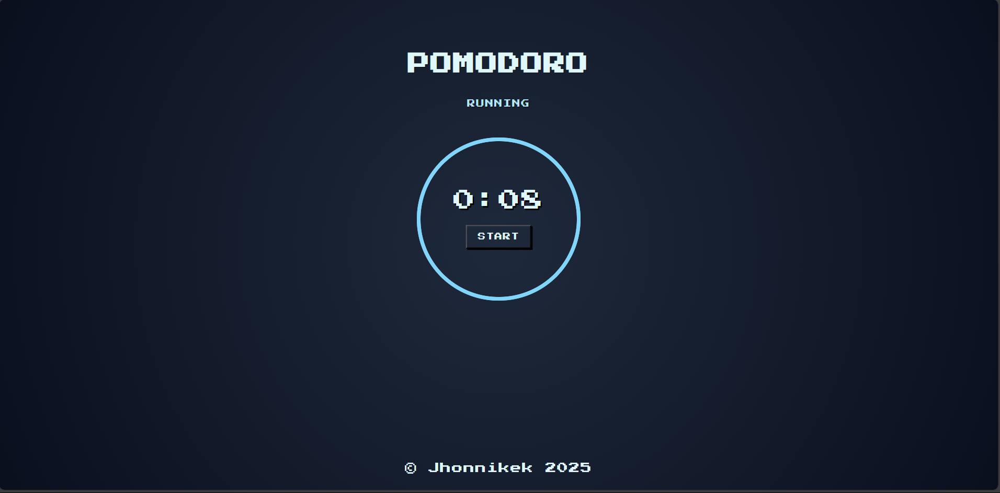

# ⏱ Pomodoro App

A simple **Pomodoro** app developed with **pure HTML, CSS, and JavaScript**. Designed to help you manage your time and boost your productivity using the Pomodoro technique.

## What is the Pomodoro Technique?

The Pomodoro Technique consists of dividing your work time into blocks of 25 minutes (called "pomodoros"), followed by a short break. After several pomodoros, a longer break is recommended.

---

##  Tech Stack

- **Frontend:** HTML, CSS, JavaScript  
- ✅ No frameworks or libraries used  
- ❌ No build tools or dependencies  

---

##  Features

- Animated circular timer
- Pomodoro countdown mode
- Status indicator (`Running`)
- Retro/arcade style with pixel fonts
- Clean and minimalist interface
- 100% Vanilla JS (no external libraries)

---

##  Screenshots

  

---

##  Getting Started

You can run the project locally with just a browser:

### 1. Clone the repository
```bash
git clone https://github.com/Jhonnikek/pomodoro-app.git
cd pomodoro
```

### 2. Open the project
Simply open index.html in your browser.

No installation or build process needed. It’s just HTML + CSS + JS.

## License

[MIT](https://choosealicense.com/licenses/mit/)